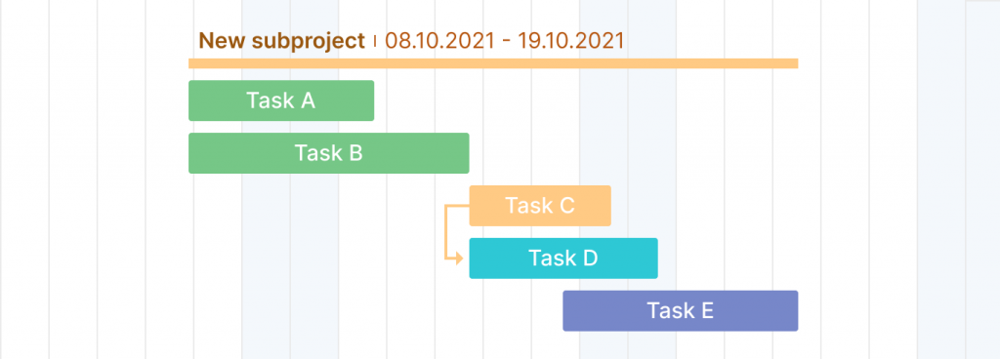

最早截止时间优先EDF（Earliest DeadlineFirst）算法是非常著名的实时调度算法之一。在每一个新的就绪状态，调度器都是从那些已就绪但还没有完全处理完毕的任务中选择最早截止时间的任务，并将执行该任务所需的资源分配给它。在有新任务到来时，调度器必须立即计算EDF，排出新的定序，即正在运行的任务被剥夺，并且按照新任务的截止时间决定是否调度该新任务。如果新任务的最后期限早于被中断的当前任务，就立即处理新任务。按照EDF算法，被中断任务的处理将在稍后继续进行。

 

该算法的思想是从两个任务中选择截至时间最早的任务,把它暂作为当前处理任务,再判断该任务是否在当前周期内,若不在当前周期内,就让另一任务暂作当前处理任务,若该任务也不在当前周期内,就让CPU空跑到最靠近的下一个截至时间的开始,若有任务在该周期内,就判断该任务的剩余时间是否小于当前截至时间与当前时间的差,若小于,则让该任务运行到结束.否则,就让该任务运行到该周期的截止时间,就立即抢回处理器,再判断紧接着的最早截至时间,并把处理器给它,做法同上,如此反复执行.

 

**1. 相对截止时间 :**
相对截止时间：任务开始到实时任务完成之间的时间间隔称为相对截止时间。它基本上是实时任务的到达和相应的截止日期之间的时间间隔。
如果任务到达时间为't'，对应的任务截止时间为't+d'，则

```
相对截止时间 = d
```


**2. 绝对截止时间 :**
The time interval between the time 0 and the completion of the real-time task is known as Relative deadline. It is basically the time interval between time 0 and corresponding deadline of the real-time task.
If the arrival time is ‘t’ and corresponding deadline of task is ‘t+d’ then,

```
Absolute deadline = t+d 
```


**Difference between Relative and Absolute Deadline of Real-time task :**


|                      RELATIVE DEADLINE                       |                      ABSOLUTE DEADLINE                       |
| :----------------------------------------------------------: | :----------------------------------------------------------: |
| It is time interval between arrival and corresponding deadline of the task. | It is time interval between time 0 and corresponding deadline of the task. |
|         It depends on the arrival time of the task.          |     It does not depend on the arrival time of the task.      |
|           It is mostly used in computational work.           |             It is not used in computation work.              |
| If A.T of task is t and deadline is (t+d), relative deadline is ‘d’. | If A.T of task is t and deadline is (t+d), absolute deadline is (t+d). |
|      It may be less than or equal to absolute deadline.      |   It is always greater than or equal to relative deadline.   |
|    It is maximum allowed response time of real-time task.    |       It is sum of release time and relative deadline.       |

 

# 任务依赖

 

任务依赖性是一种需要特定顺序才能执行的关系。 这意味着一个前面的任务依赖于另一个后续任务。

 

## 依赖关系的类型


### 完成到开始（简称FS）

这种类型的依赖意味着应该完成动作 A 才能开始动作 B。这是一种自然的项目管理连接； 因此，建议尽可能使用 FS。


### 完成到完成(简称FF)

只有完成了任务A，任务B才能结束，这种看似较为奇怪的关系事实上极为普遍，有很多任务的完成时间都是互相制约的。这种关系可以用下图来表示:

完成对完成关系的完成意味着任务B只能在任务A(它的前身)也结束时完成。


### 开始开始（Start-to-Start,SS）关系

后继任务只能在它所依赖的前置任务开始后开始。



### 开始到结束（Start-To-Fininsh,SF）

开始到完成是一种关系，其中后继任务的完成由前置任务的开始控制。 Start to Finish很少使用，一般建议避免这种任务关系。


 

# 资源访问控制协议

## 优先级翻转 优先级继承

使用实时内核,优先级反转问题是实时系统中出现得最多的问题。下图解释优先级反转是如何出现的。如图，任务1优先级高于任务2，任务2优先级高于任务3。任务1和任务2处于挂起状态，等待某一事件的发生，任务3正在运行如[下图(1)]。此时，任务3要使用其共享资源。使用共享资源之前，首先必须得到该资源的信号量(Semaphore)。任务3得到了该信号量，并开始使用该共享资源[下图（2）]。由于任务1优先级高，它等待的事件到来之后剥夺了任务3的CPU使用权[下图(3)]，任务1开始运行[下图(4)]。运行过程中任务1也要使用那个任务3正在使用着的资源，由于该资源的信号量还被任务3占用着，任务1只能进入挂起状态，等待任务3释放该信号量[下图(5)]。任务3得以继续运行[下图(6)]。由于任务2的优先级高于任务3，当任务2等待的事件发生后，任务2剥夺了任务3的CPU的使用权[下图(7)]并开始运行。处理它该处理的事件[下图(8)]，直到处理完之后将CPU控制权还给任3[下图(9)]。任务3接着运行[下图(10)]，直到释放那个共享资源的信号量[下图(11)]。直到此时,由于实时内核知道有个高优先级的任务在等待这个信号量，内核做任务切换，使任务1得到该信号量并接着运行[下图(12)]。

在这种情况下,任务1优先级实际上降到了任务3 的优先级水平。因为任务1要等,直等到任务3释放占有的那个共享资源。由于任务2剥夺任务3的CPU使用权,使任务1的状况更加恶化,任务2使任务1增加了额外的延迟时间。**任务1和任务2的优先级发生了反转**。

纠正的方法可以是,在任务3使用共享资源时,提升任务3的优先级。任务完成时予以恢复。任务3的优先级必须升至最高,高于允许使用该资源的任何任务。**多任务内核应允许动态改变任务的优先级以避免发生优先级反转现象**。然而改变任务的优先级是很花时间的。如果任务3并没有先被任务1剥夺CPU使用权，又被任务2抢走了CPU使用权,花很多时间在共享资源使用前提升任务3的优先级,然后又在资源使用后花时间恢复任务3的优先级,则无形中浪费了很多CPU时间。**真正需要的是,为防止发生优先级反转,内核能自动变换任务的优先级,这叫做优先级继承(Priority inheritance)但μC/OS-Ⅱ不支持优先级继承,一些商业内核有优先级继承功能。**


下图解释如果内核支持优先级继承的话,在上述例子中会是怎样一个过程。任务3在运行[下图(1)]，任务3申请信号量以获得共享资源使用权[下图(2)]，任务3得到并开始使用共享资源[下图(3)]。后来CPU使用权被任务1剥夺[下图(4)]，任务1开始运行[下图(5)]，任务1申请共享资源信号量[下图(6)]。此时，内核知道该信号量被任务3占用了，而任务3的优先级比任务1低，内核于是将任务3的优先级升至与任务1一样，然而回到任务3继续运行，使用该共享资源[下图(7)]，直到任务3释放共享资源信号量[下图(8)]。这时，内核恢复任务3本来的优先级并把信号量交给任务1，任务1得以顺利运行。 [下图(9)]，任务1完成以后[下图(10)]那些任务优先级在任务1与任务3之间的任务例如任务2才能得到CPU使用权，并开始运行 [下图(11)]。注意，任务2在从[下图(3)]到[下图(10)]的任何一刻都有可能进入就绪态，并不影响任务1、任务3的完成过程。在某种程度上，任务2和任务3之间也还是有不可避免的优先级反转。


## 优先继承协议（PIP）

是一种关键资源共享协议，用于在不同任务之间共享关键资源。 这允许在不同的之间共享关键资源而不会发生无界的优先级反转。 当任务发生优先级倒置时，优先级继承机制会提高具有关键资源的低优先级任务的优先级。 它允许这个任务在不经过抢占的情况下尽早使用关键资源。 它避免了无界的优先级倒置。

## 优先级上限协议(PCP)

优先级上限协议(PCP)是优先级继承协议(PIP)和最高锁定协议(HLP)的扩展。它解决了优先级继承协议的无界优先级反转、最高锁定协议的死锁和链阻塞问题，同时最大限度地减少了与继承相关的反转，这也是最高锁定协议的一个局限性。它不像优先级继承协议那样是一种贪婪的方法。在PCP中，尽管资源是空闲的，任务还是有可能被拒绝访问。

##  Difference between PIP and PCP :

|               PRIORITY INHERITANCE PROTOCOL               |                  PRIORITY CEILING PROTOCOL                   |
| :-------------------------------------------------------: | :----------------------------------------------------------: |
|  一种关键资源共享协议，用于在不同的任务之间共享关键资源   |           一种重要的资源共享协议，是PIP和HLP的扩展           |
|              克服了传统资源共享技术的局限性               |                    克服了PIP和HLP的局限性                    |
|              需要操作系统提供最低限度的支持               |                    需要操作系统的最大支持                    |
|                       不能防止死锁                        |                         防止任务死锁                         |
|              使用 PIP 的任务可能会遇到链阻塞              |                 使用PCP的任务不会遭受链阻塞                  |
|             是所有资源共享协议中最简单的协议              |                       最复杂和最有效的                       |
|                不能最小化与继承相关的反转                 |                  可以最小化与继承相关的反转                  |
|                 解决了无界优先级反转问题                  |          解决了无边界优先级反转、死锁和链阻塞等问题          |
| 在PIP中，如果资源是空闲的，则不能拒绝最高优先级任务的访问 | 而在PCP中，如果优先级值小于CSC(当前系统上限)，最高优先级的任务可以被拒绝访问，尽管资源是空闲的 |
|                     主要用于小型应用                      |                      被用于大型应用程序                      |


# 任务由四个参数建模：

1. 释放时间 $r_i$
2. 最坏执行时间（WCET） $C_i$
3. 相对截至时间  $D_i$
4. 周期 $P_i$

# 多处理器系统中的高速缓存一致性协议

在多个进程需要相同内存块的副本的多处理器系统中，这些副本之间一致性的维护引发了一个称为缓存一致性问题的问题。

这主要是由于以下原因造成的：

1. 共享可写数据

2. 进程迁移

3. 由于 I/O 导致的不一致。

## 缓存一致性协议


# 任务类型

## 零星任务


在任何随机时刻重复发生并且有硬期限的实时任务被称为零星实时任务。零星实时任务与非周期性实时任务有一些相似之处，但这些任务与非周期性实时任务不同。基本上所有高危任务都是零星任务。

例如，工业中的火灾处理任务或系统中的紧急消息到达是零星的实时任务。


## 非周期性实时任务：

在任何随机时间**重复**发生并具有软期限的动态任务称为非周期性实时任务。在两个非周期性实时任务之间，时间间隔甚至可能为零。非周期性实时任务一般包括软实时任务。

例如，在键盘上打字或鼠标移动是非周期性的实时任务。


## 周期性实时任务：

在一定时间间隔后重复执行的实时任务称为周期性实时任务。基本上，周期性实时任务由时钟中断控制。因此，周期性的实时任务也称为时钟驱动任务。
例如，在化工厂中，定期测量温度、压力和其他属性，并将所有信息传递给控制器。


**周期性、非周期和零星实时任务的区别：**

|                   周期任务                   |                   零星任务                   | 非周期性任务                                 |
| :------------------------------------------: | :------------------------------------------: | -------------------------------------------- |
|            会在一段时间后再次发生            |              在随机瞬间再次发生              | 有软截止日期或没有截止日期                   |
|                由时钟中断控制                |               不受时钟中断控制               | 是低或中等的关键任务                         |
|         可以预测周期性任务的发生时间         |          无法预测零星任务的发生时间          | 两个连续实例之间的最小间隔可以为零           |
|          包括中度关键或低度关键任务          |              包括高度关键的任务              | 包括软实时任务                               |
|              包括正常的系统任务              |          包括可能导致系统故障的任务          | 满足非周期性任务的所有实例的截止日期是困难的 |
|      可以很容易地通过循环调度器进行调度      |       通过循环调度器调度零星任务很复杂       | 不对非周期性任务进行测试                     |
| 周期性任务在通用任务调度程序中分配了时间范围 | 在通用任务调度程序中为零星任务分配了空闲时间 | 的执行不依赖于可用的松弛时间                 |
|        示例：以时间间隔测量温度和压力        |          示例：系统中的紧急消息到达          | 永远不会被调度程序拒绝                       |


# 抖动

有时工作的实际**释放时间**是不知道的。只知道 $r_i$ 在[$r_i$-， $r_i$+]范围内。这个范围被称为释放时间抖动。这里$r_i$-是一个工作可以最早被释放的时间，$r_i$+是一个工作可以最晚被释放的时间。只知道作业的执行时间范围[$e_i$-， $e_i$+]。这里$e_i$是一个作业完成其执行所需的最小时间量，$e_i$+一个作业完成其执行所需的最大时间量。

# 偏移

- **Offset** refers to the time delay experienced by the first job (instance) of a periodic task.
- **Jitter** is the maximum deviation from the periodic release times that a job (instance) can experience.

# 优先约束

如果任务中的作业可以按任何顺序执行，则它们是独立的。如果任务中的作业必须执行有特定的顺序，则称作业具有优先约束。


# DTD文件

[XML文件中的DTD是什么](https://blog.csdn.net/qq_40849099/article/details/80457850)


# 排队论Queueing Theory

假设我们观察一个系统 $Time_{观察}$ 分钟，在观察中，我们记录系统为每个任务服务的时间。然后汇总。在$Time_{观察}$ 中完成的任务数为 $Number_{任务}$ ，整个系统汇总的总和为 $Time_{总和} \geq Time_{观察}$ 那么；
$$
\begin{align}
系统平均任务数=& \frac{Time_{总和}}{Time_{观察}} \\
平均响应时间 =& \frac{Time_{总和}}{Number_{任务}} \\
到达速率 =& \frac{Number_{任务}}{Time_{观察}}
\end{align}
$$


第一个任务又可以写为
$$
\frac{Time_{总和}}{Time_{观察}}=\frac{Time_{总和}}{Number_{任务}} \times \frac{Number_{任务}}{Time_{观察}}
$$
得到Little定律

系统平均任务数 = 到达速率 * 平均响应时间


# 响应时间

响应时间 = 完成时间 - 释放时间


# 如何计算抢占开销

可选的可能

1. 将所有可能的间接费用纳入WCET范围，必须假设每次访问内存时都会出现缓存未命中，这是非常悲观的
2. 扩展WCET和响应时间分析之间的接口，在响应时间分析期间捕获绑定CRPD的任务的内存访问行为

## 如何描述任务的内存访问行为？


# CRPD

当微体系结构——缓存存在时，缓存必然会对实时系统的最坏执行时间的预测和估算产生影响。缓存对实时系统的影响主要存在两个方面:一方面是产生了时序异常（Timing Anomalies) 的现象，也就是说系统局部的最坏行为并不一定产生全局的最坏结果，如局部最坏行为——缓存的失效，由于调度的影响=很可能会导致比缓存命中更短的执行时间。另一方面就是缓存会使本来不可预测的实时系统变得更难预测。一条指令的执行时间会因为缓存的命中和失效而产生很大的不同，而一次访问是针对缓存还是针对主存取决于程序的历史动态行为。在抢占式实时系统中，任务抢占不仅会带来抢占花销，还会带来额外的缓存失效。因为抢占任务会驱逐（ evict〉被抢占任务的主存块，这样当被抢占任务重新开始执行时，就会发生缓存失效，被抢占任务不得不从主存中重新加载这些被驱逐的块，加载这些驱逐块所需的时间就是与缓存有关的抢占代价( cache-related preemption delay，CRPD)。


# Cheddar中用户自定义的调度

T（2，8，1，5）：start_time、period、capacity、deadline

Capacity 是特定任务可以使用的 CPU 的时间，CPU的容量

任务的capacity是其一个周期内需要执行的时间

# UCB ECB

UCB和ECB的定义：
UCB（Useful Cache Block）：
	如果一个主存块m被称为一个UCB，需要满足以下两个条件:
	(1)   主存块m在程序执行点Р处位于缓存中;
	(2）主存块m在Q点被再次使用，并且从Р点到达Q点的过程中m没有被替换出缓存。


在图中，在Р点主存块A、B和C都位于缓存内。从P点开始执行，由于主存块A、B和C都没有被替换出缓存，所以主存块A、B和C都是UCBs。
当在程序执行点Р发生抢占时，只有满足，i）处于缓存中，ii）会被再次使用这两个条件的主存块被替换出缓存时,才会引起抢占代价。因此，P点处的UCB的数目就是由于发生Р点的抢先而需要加载的主存块的上限。对于一个任务来说，可能最大的抢占代价就是由拥有最多UCB的程序执行点所决定的。对于随后发生的每一次抢占，只需要考虑UCB数量仅次于上一个的程序点就可以了。


在图中，P点前主存块A、B和C都位于缓存内。抢占发生在P点。高优先级任务执行过程中，需要对主存块X、Y进行访问，于是块B和C被替换出缓存，所以块X和Y是 ECBs。

ECB：抢占任务执行过程中被访问的一个主存块就被称为一个 ECB


## 时隙和帧

时隙相当于每分钟中的第n秒至第n+m秒，是有顺序的；而帧是指n秒组成的时间段。N个时隙发送的内容可以组成帧。


### 任务就绪状态和释放时间

就绪状态：一切都准备好了，等待CPU

释放时间：还要考虑资源等问题，是否已经准备好，所以两个概念并不能等同。

